{width="6.0680555555555555in"
height="1.1132042869641294in"}

**Autonomous Cloud Lab**

October 2018

{width="4.875in"
height="3.2430555555555554in"}

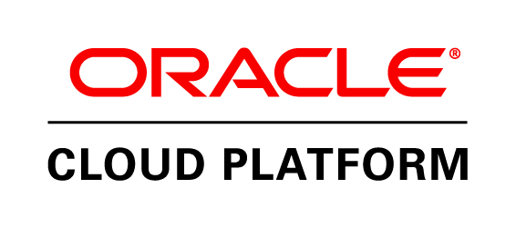{width="1.8819444444444444in"
height="0.8333333333333334in"}

########## Table of Contents {#table-of-contents .TOCheader}

 {#section .TOCHeading}

[Introduction 4](#introduction)

[Environment 5](#environment)

[Lab prerequisites 6](#lab-prerequisites)

[Section 1. Provisioning an Autonomous Data Warehouse Service
7](#section-1.-provisioning-an-autonomous-data-warehouse-service)

[Section 2. Connecting to Autonomous Data Warehouse
15](#section-2.-connecting-to-autonomous-data-warehouse)

[Section 3. Provisioning an Autonomous Transaction Processing Service
20](#section-3.-provisioning-an-autonomous-transaction-processing-service)

[Section 4. Connecting to Autonomous Transaction Processing Database
26](#section-4.-connecting-to-autonomous-transaction-processing-database)

[Section 5. Creating an Autonomous Analytics Cloud instance
32](#section-5.-creating-an-autonomous-analytics-cloud-instance)

[Section 6. Using Oracle Autonomous Analytics. 36](#_Toc525204419)

[Section 7. Conclusion 52](#section-7.-conclusion)

##########  {#section-1 .TOCandList}

########## Introduction

Based on machine learning, Oracle Autonomous Cloud represents a new
category of software automation. Oracle recently introduced Oracle
Autonomous Database Cloud---an incredibly important milestone. Oracle
Autonomous Cloud leverages the power of AI and machine learning to
deliver self-driving, self-securing, and self-repairing autonomous
capabilities. This dramatically transforms how companies innovate by
simplifying processes, reducing inefficiencies, and allowing companies
to free resources to focus on innovation. With Oracle Autonomous Cloud,
companies can lower costs, reduce risks, accelerate innovation, and get
predictive insights.

 

**Self-Driving**

-   Auto provision, secure, monitor, back up, recover, and troubleshoot

-   Instantly grow and shrink compute or storage without downtime

 

**Self-Securing**

-   Adaptive intelligence-enabled cyber threat detection and remediation

-   Automatic data encryption, security patches application

 

**Self-Repairing**

-   Automated protection from downtime

-   Up to 99.995 percent availability\*. \< 2.5 minutes downtime per
    month, including planned maintenance

########## Environment

The following are the details of this specific environment where the
workshop was built. Many of the values you can change them to speciffic
values from your environment.

  **Property**           **Value**
  ---------------------- -------------------------------------------------
  Cloud Account          gse00014216
  Cloud User             andrei.manoliu\@oracle.com
  ADWC Instance Name     ADWCInstance001
  ADWC database Name     ADWCdb001
  ADWC Admin user name   Admin
  ADWC Admin password    \<12 Character password like **Welcome12345**\>
  ATP Instance Name      ATPInstance001
  ATP database Name      ATPdb001
  ATP Admin user name    Admin
  ATP Admin password     \<12 Character password like **Welcome12345**\>
  OAAC Instance Name     OAACv5

########## Lab prerequisites

**Access Check List**

To secure the best start for the hands-on we need to check the access
right.

This checklist will check access to below cloud service that is use for
the hands-on labs.

> **-** Autonomous Data Warehouse
>
> **-** Autonomous Transaction Processing
>
> \- Analytics Cloud
>
> **Autonomous Data Warehouse -- Access Check**
>
> To be able to provisioning the Cloud Service you need to member of
> 'OCI\_Administrator (Provide administrative access in Oracle Cloud
> Infrastructure.)'
>
> Required Role: **OCI\_Administrator (Provide administrative access in
> Oracle Cloud Infrastructure.)**
>
> **Autonomous Transaction Processing -- Access Check**
>
> To be able to provisioning the Cloud Service you need to member of
> 'OCI\_Administrator (Provide administrative access in Oracle Cloud
> Infrastructure.)'
>
> Required Role: **OCI\_Administrator (Provide administrative access in
> Oracle Cloud Infrastructure.)**
>
> **Analytics Cloud -- Access Check**
>
> To be able to provisioning the Cloud Service you need to member of
> 'AUTONOMOUS\_ANALYTICS\_ServiceAdministrator'
>
> **Required Role: AUTONOMOUS\_ANALYTICS\_ServiceAdministrator**

How to check
------------

+-----------------------------------+-----------------------------------+
| Sign into you Oracle Cloud        | 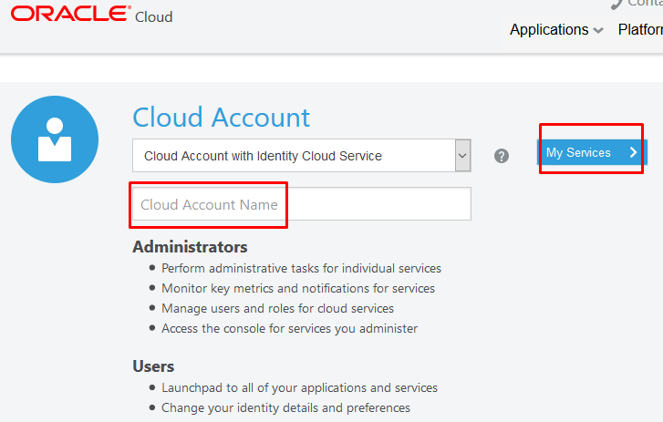{width="3. |
|                                   | 0965277777777778in"               |
| <https://cloud.oracle.com/en_US/s | height="1.9722222222222223in"}    |
| ign-in>                           |                                   |
|                                   |                                   |
| Type you Cloud Account Name and   |                                   |
| press My Services                 |                                   |
+===================================+===================================+
| Type your use name and password   | {width="3. |
| then press Sign In                | 0965277777777778in"               |
|                                   | height="2.214583333333333in"}     |
+-----------------------------------+-----------------------------------+
| Go to Users, top right corner     | 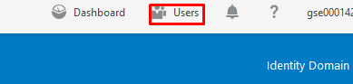{width="3. |
|                                   | 0965277777777778in"               |
|                                   | height="0.7402777777777778in"}    |
+-----------------------------------+-----------------------------------+
| In User Management, find you self | 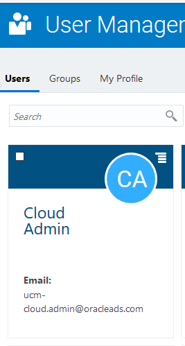{width="1. |
| and press                         | 1770833333333333in"               |
|                                   | height="2.199867672790901in"}     |
+-----------------------------------+-----------------------------------+
| Go to Role                        | 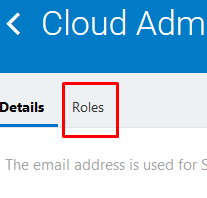{width="2. |
|                                   | 15625in"                          |
|                                   | height="2.0625in"}                |
+-----------------------------------+-----------------------------------+
| Scroll down the list and check    |                                   |
| what role you have.               |                                   |
|                                   |                                   |
| If you do not have the need role. |                                   |
| You need to talk to your Cloud    |                                   |
| Service Administator              |                                   |
+-----------------------------------+-----------------------------------+

**SQL Developer**

You will need SQL Developer installed on your computer to do the
exercises in this lab guide. The minimum SQL Developer version that is
required to connect to an Oracle Autonomous Data Warehouse Cloud
instance is SQL Developer 17.4.

To exercise all labs, you will need the latest SQL Developer version
18.1.

> Follow these steps to install SQL Developer depending on your
> platform.
>
> **Windows 64-bit**
>
> Install SQL Developer 18.1 using "Windows 64-bit with JDK 8
> included" from:
>
> <http://www.oracle.com/technetwork/developer-tools/sql-developer/downloads/index.html>
>
> **Other platforms**
>
> 1\. Install JDK 8u161 from:
>
> <http://www.oracle.com/technetwork/java/javase/downloads/jdk8-downloads-2133151.html>
>
> 2\. Install SQL Developer 18.1 for your platform:
>
> <http://www.oracle.com/technetwork/developer-tools/sql-developer/downloads/index.html>

**Good Practise**

It is recommend to you a **separated Compartment** in Oracle Cloud
Infrastructure. Therefore, it will not have impact of any other running
workload.

How to create a Compartment -
<https://docs.cloud.oracle.com/iaas/Content/Identity/Tasks/managingcompartments.htm>

#################### Section 1. Provisioning an Autonomous Data Warehouse Service

In this section you will be provisioning an Autonomous Data Warehouse
Cloud (ADWC) instance using the UI capabilities of the service.

**Note:** Using your cloud environment you should have access to:

-   The Cloud Account Name

-   The Username

-   The Password

1.  Go to
    [cloud.oracle.com](file:///D:\Workshops\Autonomous%20DW\Workshop\cloud.oracle.com)
    and click **Sign In** to login to your Oracle Cloud account.

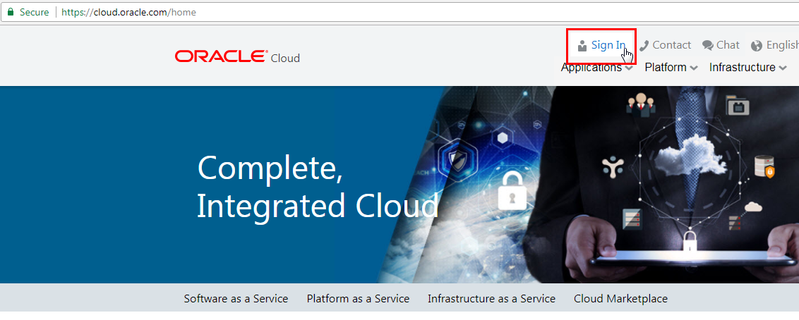{width="6.595833333333333in"
height="2.645138888888889in"}

2.  Enter the **Cloud Account Name**. In this example, the Cloud Account
    Name is *gse00014216*. Click **My Services**.

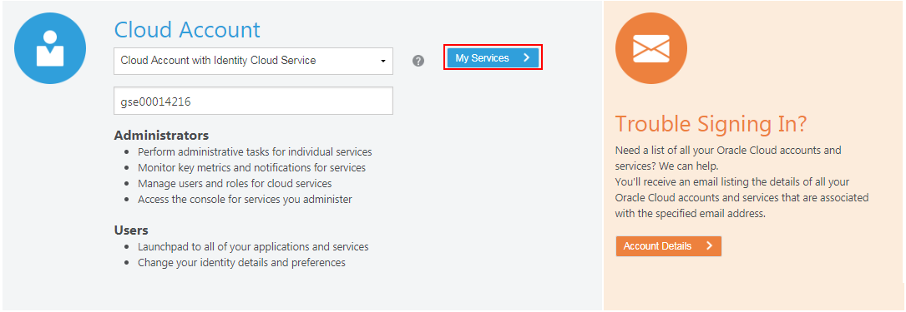{width="6.595833333333333in"
height="2.279861111111111in"}

3.  On the login page, fill in the Username and Password for your cloud
    account. Click **Sign In**.

{width="5.197267060367454in"
height="4.3536220472440945in"}

4.  We will start from the Cloud Dashboard and go to Compute service
    console (the OCI Console). For this go to the Navigation Menu on the
    top left part of the Dashboard Home
    page.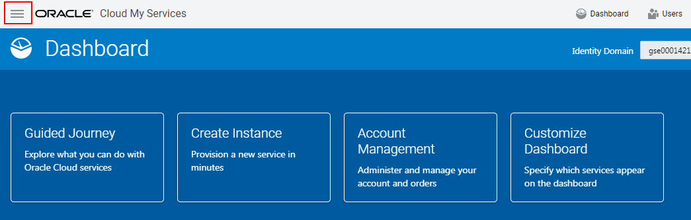{width="6.595833333333333in"
    height="2.1083333333333334in"}

5.  In the Services list choose Compute.

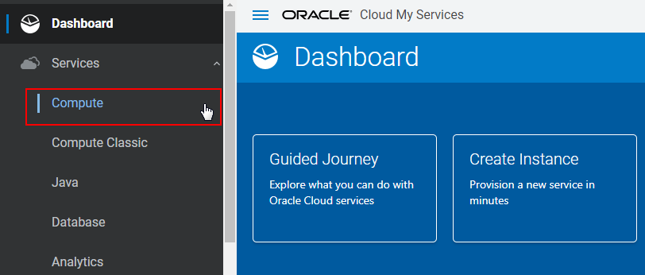{width="6.595833333333333in"
height="2.810416666666667in"}

6.  The OCI Console launches and it will take you to the Home page page.
    Autonomous Data Warehouse, as Autonomous Transaction Processing are
    both deployed on OCI datacentres and can be created from OCI
    interface.

    Click on the **Menu** on the top left of the Page.

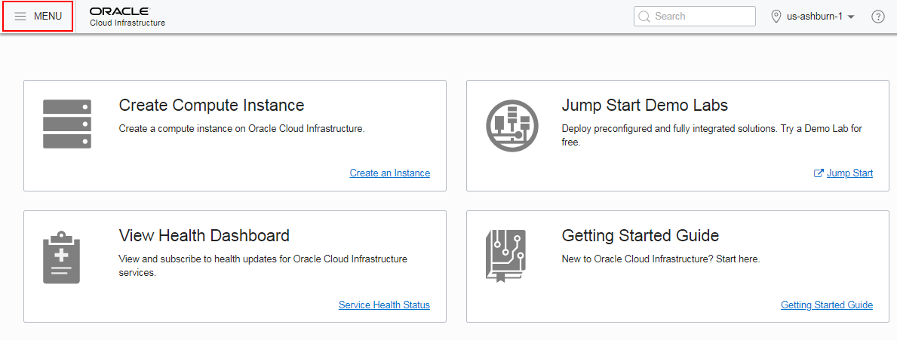{width="6.595833333333333in"
height="2.502083333333333in"}

7.  A new Menu appears and select Autonomous Transaction Processing
    service under the Database Category\
    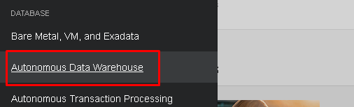{width="5.270833333333333in"
    height="1.6041666666666667in"}

8.  On the right side of the page, you could choose a compartment if you
    have one already.

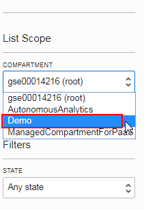{width="2.197642169728784in"
height="3.1871019247594052in"}

9.  Click Create Autonomous Data Warehouse button to create a new
    service instance.

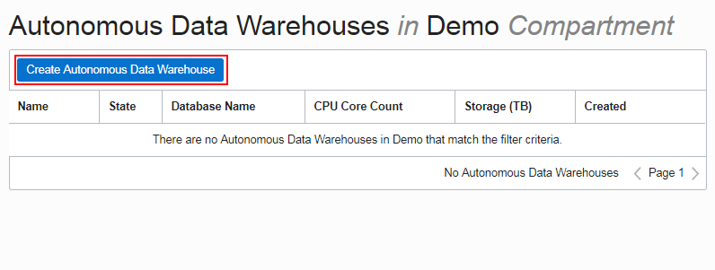{width="6.595833333333333in" height="2.49375in"}

10. A new window appears. Enter the following information in the
    **Create New Instance** screen:

    ***Display name*** -- Choose a unique display name. In our case we
    will use ADWCInstance001

**Database Name --** Choose a unique database name. In our case is
ADWCdb001

***CPU Count*:** **1**

***Storage Capacity (TB):* 1**

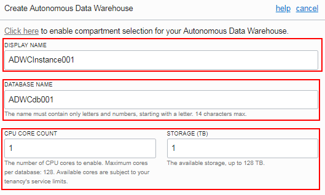{width="5.509727690288714in"
height="3.31208552055993in"}

In the Administrator Credentials section enter the Administrator
Password and confirm the password:

***Administrator Password:*** 12 Character password like
**Welcome12345**

Also tick the **SUBSCRIBE TO NEW DATABASE SOFTWARE LICENSES AND THE
DATABASE CLOUD SERVICE** radio button.

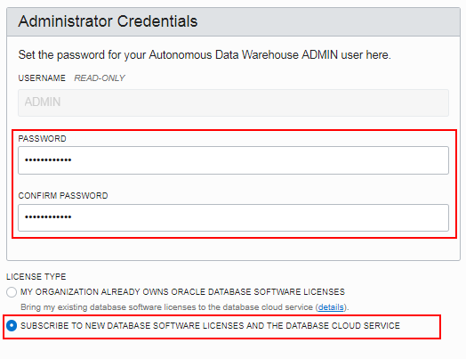{width="5.457650918635171in"
height="4.197391732283465in"}

Click **Create Autonomous Data Warehouse** button.

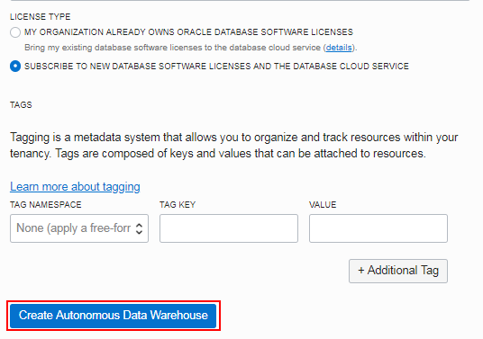{width="5.582635608048994in"
height="3.9265923009623798in"}

11. Notice that the instance is on provisioning state

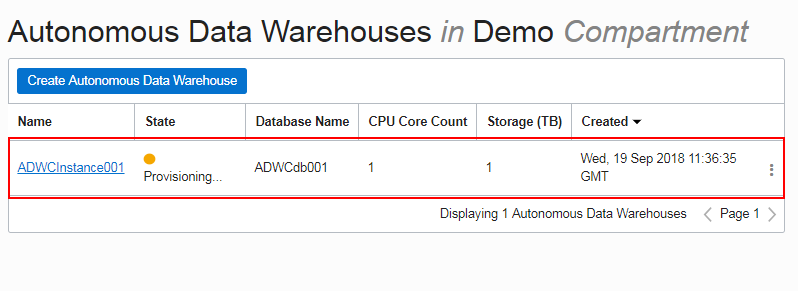{width="6.595833333333333in"
height="2.404861111111111in"}

12. Click the **refresh** arrow button to see the status of your
    database. Once the service is provisioned click on its name to open
    the *Service Overview* page.

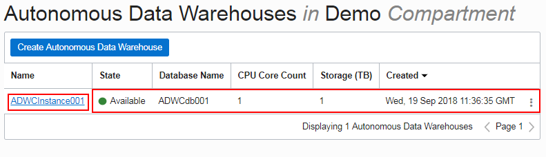{width="6.595833333333333in"
height="1.9006944444444445in"}

13. Check the ***Service Overview*** page for more details on your ADW
    instance.

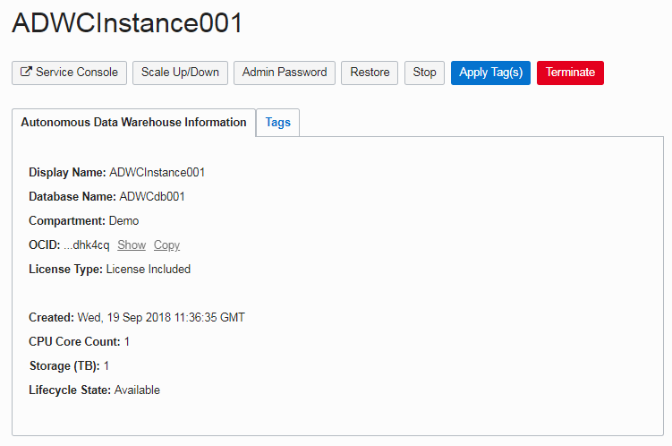{width="6.595833333333333in"
height="4.374305555555556in"}

#################### Section 2. Connecting to Autonomous Data Warehouse

In this section you will go through the steps of accessing the
credentials for connecting to your ADW instance with external clients,
like SQL Developer.

1.  The first step in accessing the credentials is to log in to the
    *Service Console* associated to your ADW instance. To do that, click
    on the **Service Console button** in the ADWCInstance001 overview.

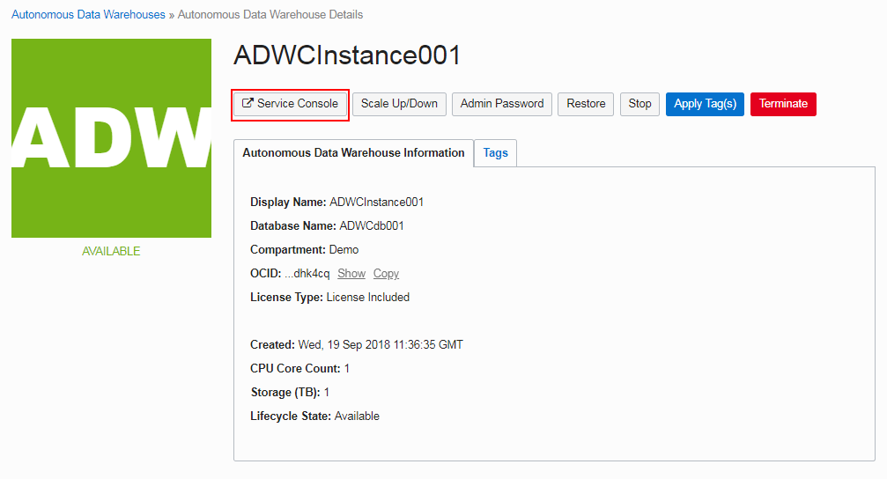{width="6.595833333333333in" height="3.5625in"}

2.  Login to the *Service Console* with the following credentials:

    ***Username*:** **admin**

    ***Password*:** **Welcome12345**

    **Note:** this is the password you specified during the provisioning
    of the service.

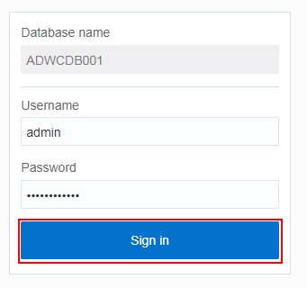{width="3.5516393263342083in"
height="3.3329166666666667in"}

3.  On the home page, click the **Administration** menu on the left side
    of the page.

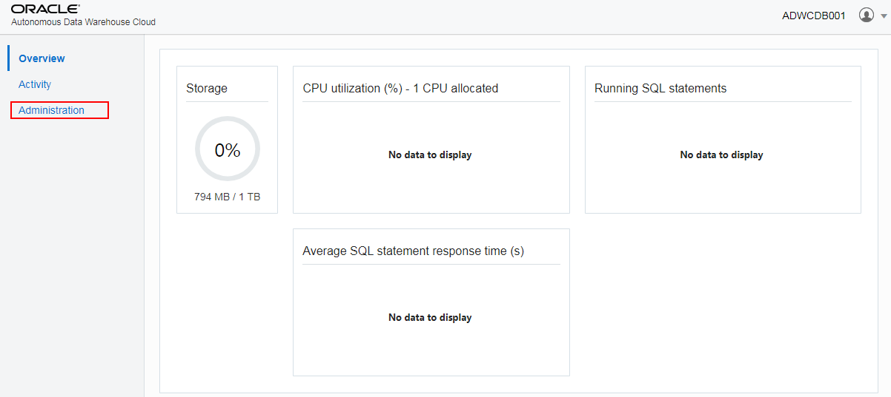{width="6.595833333333333in"
height="2.946527777777778in"}

4.  Click **Download Client Credentials**.

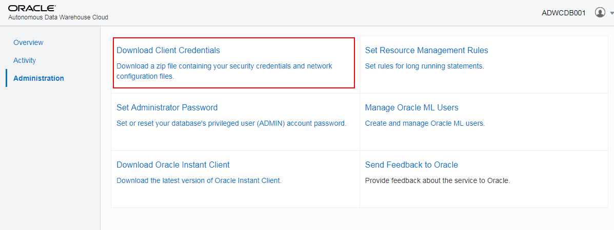{width="6.595833333333333in"
height="2.479861111111111in"}

5.  Enter a password before downloading the wallet zip file containing
    the credentials. This password will protect the sensitive data
    residing in the file. You can use **Welcome12345** as the password
    and then re-type it for confirmation.

    Click **Download** and save the file on your local computer.

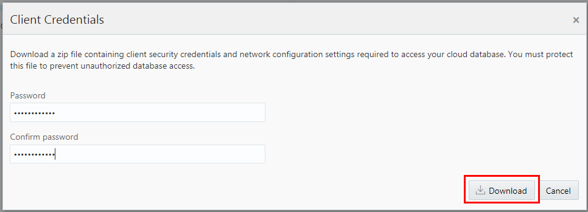{width="6.5in" height="2.348611111111111in"}

A zip archive with the wallet was downloaded:

{width="6.595833333333333in"
height="0.5368055555555555in"}

Next we will open SQL Developer and create a connection there.

6.  Open **SQL Developer** and click to create a new connection.

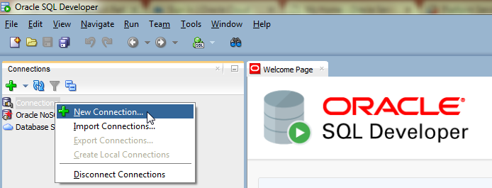{width="6.595833333333333in" height="2.51875in"}

7.  Fill in the details to connect to the database as follows:

    ***Connection Name***: **ADWCdb001**

    ***Username***: **admin**

    ***Password***: **Welcome12345**

    ***Connection Type**:* **Cloud PDB**

    ***Role**:* **default**

    ***Configuration File**:* Browse to the location of the zipped
    wallet and select it

    ***Keystore Password**:* **Welcome12345**

    **Note**: The Keystore Password is the one you selected for your
    wallet before downloading it. The Service you need to choose is the
    name you gave to your service when provisioning it.

    ***Service***: **adwcdb001\_high** - it is the service of the
    ADWCdb001 instance created which lead to consumer group high.

    Click **Test** to check the connection.

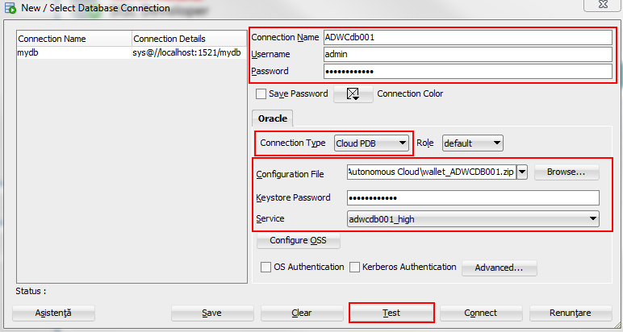{width="6.595833333333333in"
height="3.520138888888889in"}

8.  If the test is successful **Save** the connection and click
    **Connect** to access the database.

{width="6.595833333333333in" height="3.5375in"}

We connected with SQL Developer to the database. The next step would be
to load date into the ADWC using SQL Developer.

#################### Section 3. Provisioning an Autonomous Transaction Processing Service

In this section you will be provisioning an Autonomous Transaction
Processing (ATP) instance using the UI capabilities of the service.

We will start from the Cloud Dashboard and go to Compute service console
(the OCI Console). For this go to the **Navigation Menu** on the top
left part of the **Dashboard** Home page.

{width="6.595833333333333in"
height="2.1083333333333334in"}

The navigation Menu appears and drop down the **Services** list.

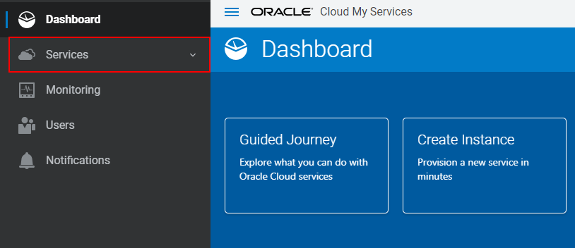{width="6.595833333333333in"
height="2.8520833333333333in"}

In the **Services** list choose **Compute**.

{width="6.595833333333333in"
height="2.810416666666667in"}

The OCI Console launches and it will take you to the Home page page.
Autonomous Data Warehouse, as Autonomous Transaction Processing are both
deployed on OCI datacentres and can be created from OCI interface.

Click on the **Menu** on the top left of the Page.

{width="6.595833333333333in"
height="2.502083333333333in"}

A new Menu appears and select Autonomous Transaction Processing service
under the Database Category

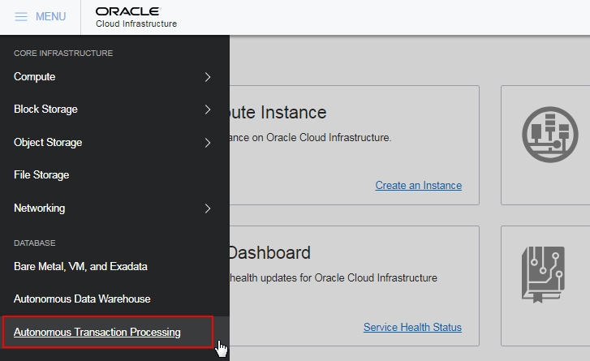{width="6.595833333333333in" height="4.0375in"}

The Home page for ATP appears.

On the right side of the page, you could choose a compartment if you
have one already created or use the default **root** compartment. In our
case we are going to choose the DEMO compartment where the instances
will be created.

{width="2.197642169728784in"
height="3.1871019247594052in"}

Click Create Autonomous Transaction Processing Database button to create
a new service instance.

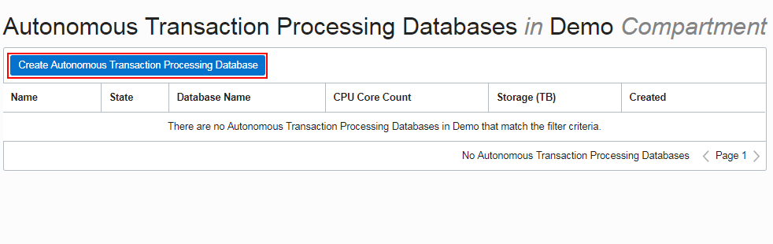{width="6.595833333333333in"
height="2.0819444444444444in"}

A new window appears. Enter the following information in the **Create
New Instance** screen:

***Display name*** -- Choose a unique display name. In our case we will
use ATPInstance001

**Database Name --** Choose a unique database name. In our case is
ATPdb001

***CPU Count*:** **1**

***Storage Capacity (TB):* 1**

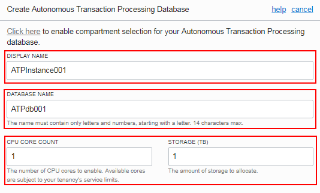{width="5.561804461942257in"
height="3.3641622922134733in"}

In the Administrator Credentials section enter the Administrator
Password and confirm the password:

***Administrator Password:*** 12 Character password like
**Welcome12345**

Also tick the **SUBSCRIBE TO NEW DATABASE SOFTWARE LICENSES AND THE
DATABASE CLOUD SERVICE** radio button.

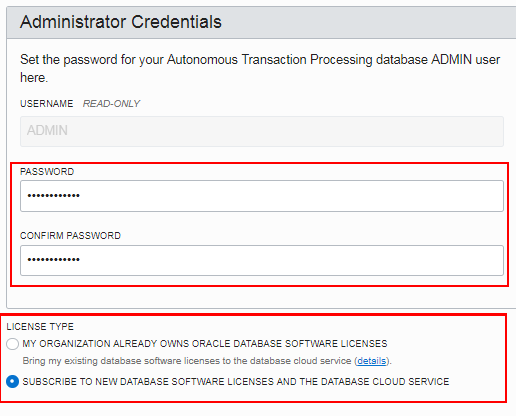{width="5.374328521434821in"
height="4.332791994750656in"}

Click **Create Autonomous Transaction Processing Database** button.

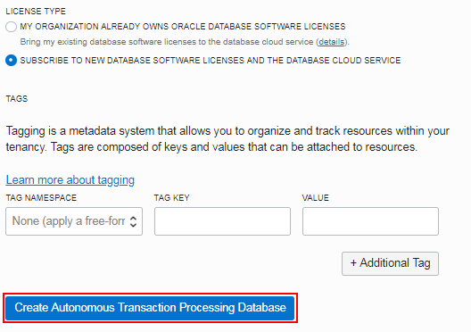{width="5.499312117235346in"
height="3.8745155293088365in"}

Notice that the instance is on provisioning state. It takes less than 2
minutes for the instance to provision.

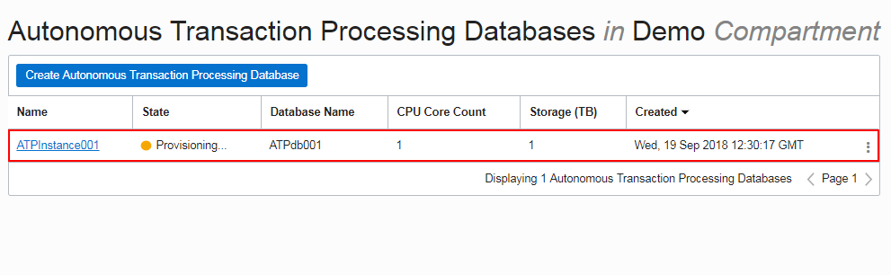{width="6.595833333333333in"
height="2.0368055555555555in"}

Click the **refresh** arrow button to see the status of your database.
Once the service is provisioned click on the Instance name
(ATPInstance001) to open the *Service Overview* page.

{width="6.595833333333333in"
height="1.9083333333333334in"}

Check the ***Service Overview*** page for more details on your ATP
instance.

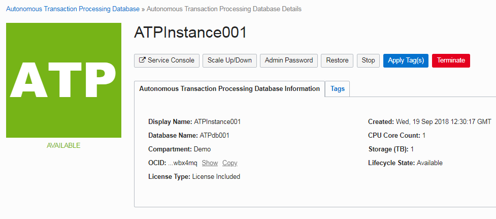{width="6.595833333333333in"
height="2.9097222222222223in"}

We created an ATP instance. Next we will download the database
credentials and connect to this instance using SQL Developer.

#################### Section 4. Connecting to Autonomous Transaction Processing Database

In this section you will go through the steps of accessing the
credentials for connecting to your ADW instance with external clients,
like SQL Developer.

1.  The first step in accessing the credentials is to log in to the
    *Service Console* associated to your ATP instance. To do that, click
    on the **Service Console button** in the ATPInstance001 overview.

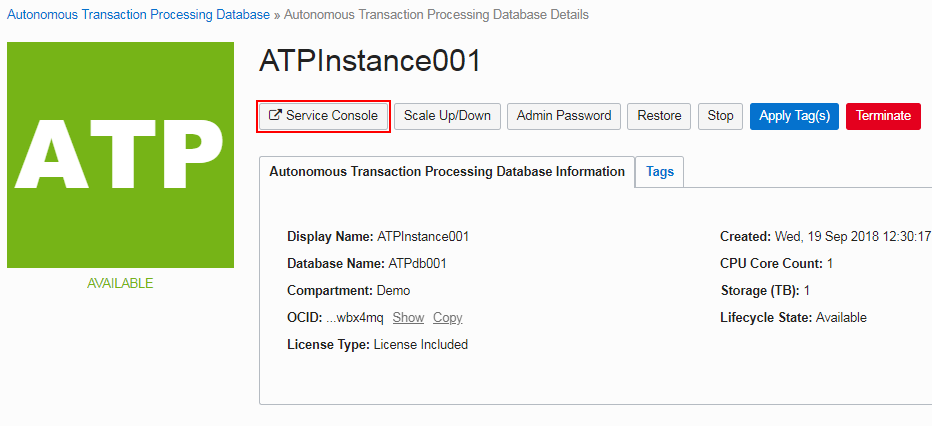{width="6.595833333333333in"
height="3.0145833333333334in"}

2.  Login to the *Service Console* with the following credentials:

    ***Username*:** **admin**

    ***Password*:** **Welcome12345**

    **Note:** this is the password you specified during the provisioning
    of the service.

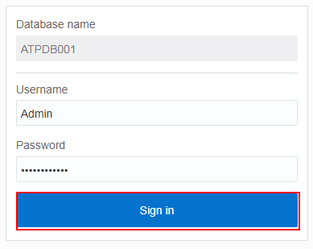{width="4.051576990376203in"
height="3.218347550306212in"}

3.  On the home page, click the **Administration** menu on the left side
    of the page.

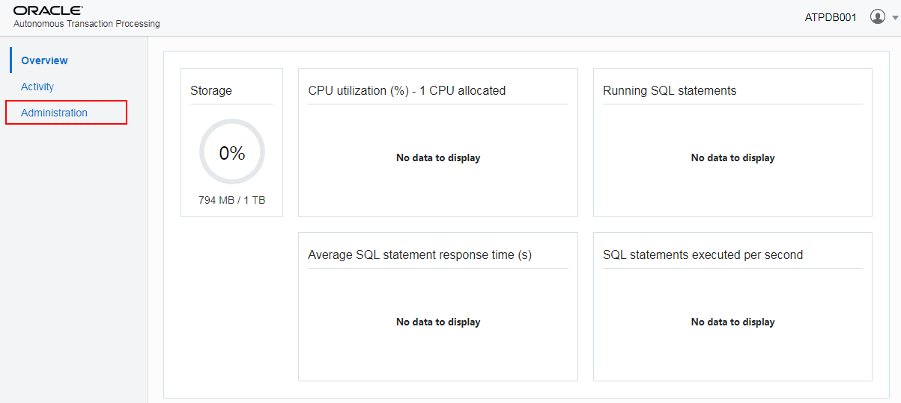{width="6.595833333333333in"
height="2.9604166666666667in"}

4.  Click **Download Client Credentials**.

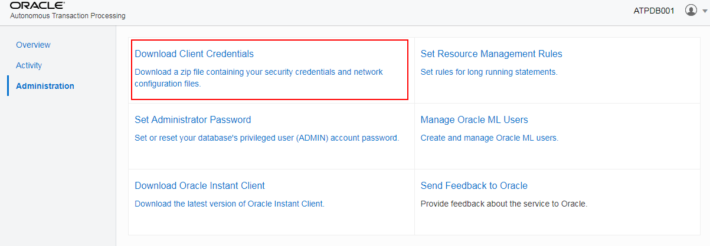{width="6.595833333333333in"
height="2.2916666666666665in"}

5.  Enter a password before downloading the wallet zip file containing
    the credentials. This password will protect the sensitive data
    residing in the file. You can use **Welcome12345** as the password
    and then re-type it for confirmation.

    Click **Download** and save the file on your local computer.

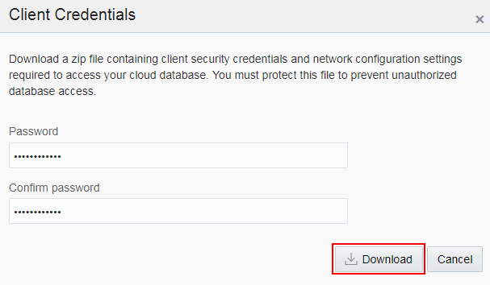{width="6.322125984251969in"
height="3.6870395888014in"}

A zip archive with the wallet was downloaded:

{width="2.3747036307961507in"
height="0.4895220909886264in"}

Next we will open SQL Developer and create a connection there.

6.  Open **SQL Developer** and click to create a new connection.

{width="6.595833333333333in" height="2.51875in"}

7.  Fill in the details to connect to the database as follows:

    ***Connection Name***: **ATPdb001**

    ***Username***: **admin**

    ***Password***: **Welcome12345**

    ***Connection Type**:* **Cloud PDB**

    ***Role**:* **default**

    ***Configuration File**:* Browse to the location of the zipped
    wallet and select it

    ***Keystore Password**:* **Welcome12345**

    **Note**: The Keystore Password is the one you selected for your
    wallet before downloading it. The Service you need to choose is the
    name you gave to your service when provisioning it.

    ***Service***: **atpdb001\_high** - it is the service of the
    ATPdb001 instance created which lead to consumer group high.

    Click **Test** to check the connection.

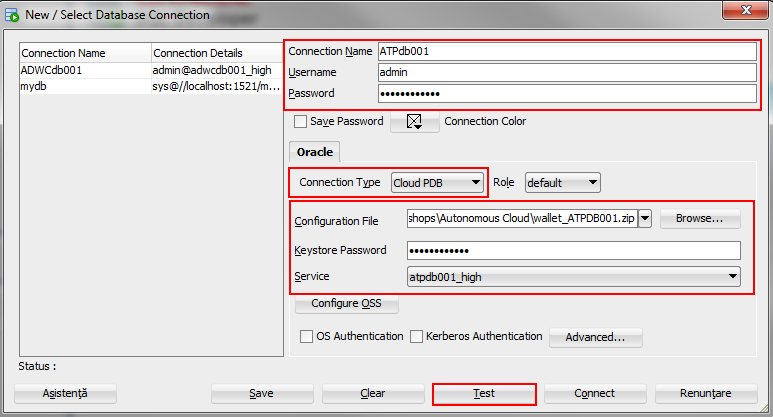{width="6.595833333333333in"
height="3.558333333333333in"}

8.  If the test is successful **Save** the connection and click
    **Connect** to access the database.

{width="6.595833333333333in" height="3.5375in"}

The connection to the ATP database using SQL Developer is created. The
next step would be to load a table using SQL Developer from a local
file.

#################### Section 5. Creating an Autonomous Analytics Cloud instance

You use Oracle Cloud Stack to set up services with Oracle Autonomous
Analytics Cloud.

1.  In My Services, open the dashboard.

2.  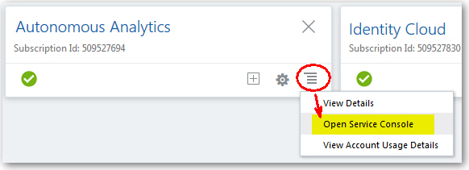{width="6.062992125984252in"
    height="2.2007874015748032in"}Navigate to **Autonomous Analytics**,
    click the **Action Menu**, and then select **Open Service Console**.

3.  Click **Create Instance**.

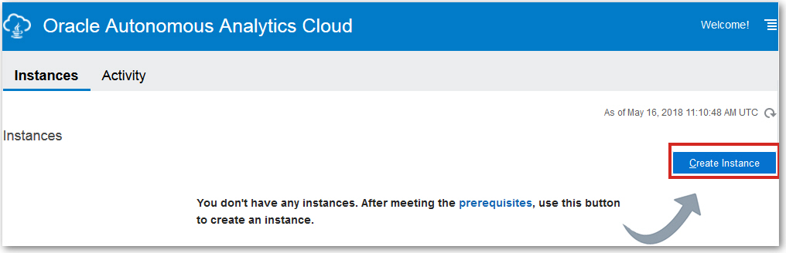{width="7.1930555555555555in"
height="2.3222222222222224in"}

4.  In the **Details** area:

    -   **Name**: Enter a name for your service instance. The name must
        start with a letter and can contain only letters and numbers.

    -   **Description:** (Optional) Enter a description.

    -   **Notification Email**: Enter the email address of the person
        who should receive status updates about this service. This
        person is usually you, the Cloud Account Administrator who's
        setting up the service.

    -   **Region**

    -   **Tags:** (Optional) Add tags and assign tags to this service.

    -   **License Type:** Bring your own license or subscribe to a new
        Autonomous Analytics Cloud software license and the Autonomous
        Analytics Cloud.

> For example:
>
> 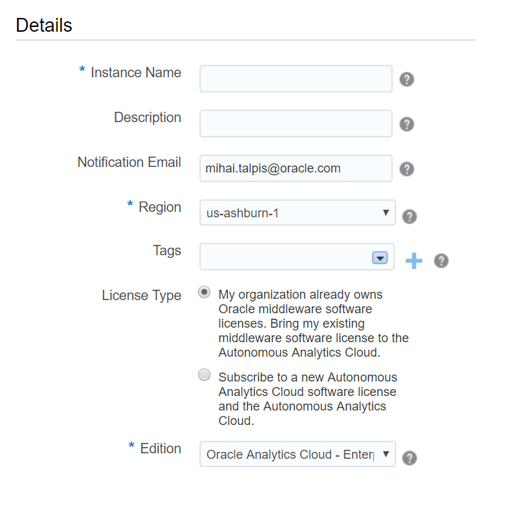{width="4.791044400699913in"
> height="4.745926290463692in"}

5.  In the **Select Region** area:

    -   **Region**: A region is a localized geographic area.

> 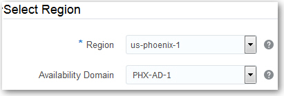{width="4.277777777777778in"
> height="0.925in"}For example:

6.  In the **Choose Service Options** area:

    -   **Edition:** Select the edition of Oracle Analytics Cloud that
        you want to use. The edition that you select determines the
        feature set that you can use.

        -   Enterprise Edition --- **EE-Enterprise**

        -   Standard Edition --- **SE-Standard**

        -   Data Lake Edition --- **DATALAKE-Datalake**

    -   **Feature Set:** Select the features that you want to deploy.
        The options available to you depend on the edition you're
        subscribed to. If you select **Business Intelligence**, you
        automatically have access to Data Visualization.

        -   Standard Edition --- **Data Visualization**

        -   Data Lake Edition --- **Data Visualization** or **Essbase**

        -   Enterprise Edition --- **Data
            Visualization** or **Essbase** or **Business
            Intelligence** (includes Data Visualization)

    -   **Number of OCPUs:** Select the number of Oracle Compute Units
        (OCPUs) for your environment.

> **\* You can raise a service request to change the compute shape after
> creating the service, if the needs of your business change.**
>
> For example:
>
> 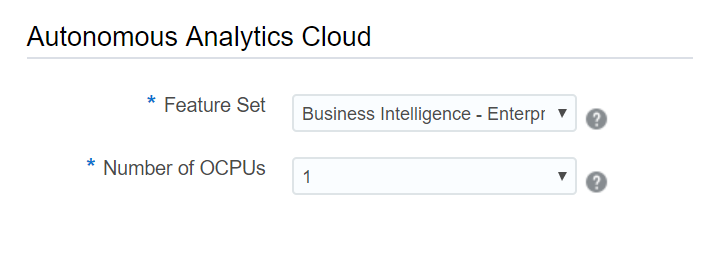{width="5.4385422134733155in"
> height="1.6567169728783901in"}

7.  Click **Next**.

8.  Verify that the details are correct, and click **Confirm**.

It takes about half an hour to create the service. Oracle sends an email
to the designated email address when your service is ready. Display the
Activity page to check the current status. 

9.  After the instance has been created you can go ahead and launch the
    platform by clicking on the menu drop-down button and selecting
    **Oracle Analytics Cloud URL**

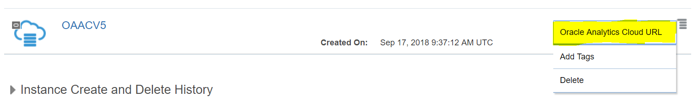{width="5.94225612423447in"
height="1.3880599300087488in"}

10. 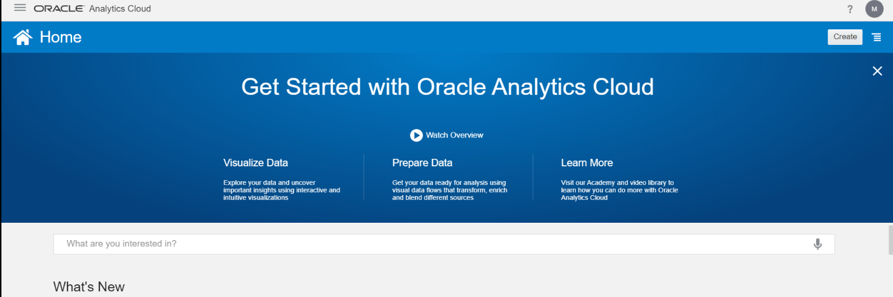{width="7.021527777777778in"
    height="2.3430555555555554in"}You will be redirected to the
    following page, which is the Data Visualization welcome page:

11. In the left hand side you will find the Analytics Cloud menu with
    the following
    options: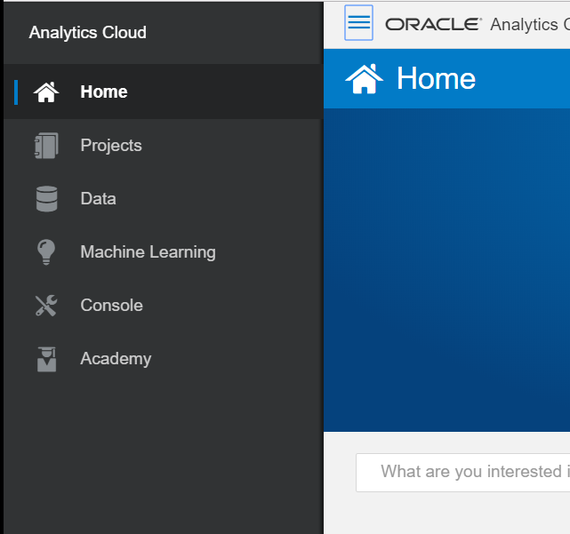{width="4.006944444444445in"
    height="2.8006944444444444in"}

    -   **Home:** easy access to manage your connections, view existing
        data sets, projects and data flows.

    -   **Projects:** you can manage folders and projects from this
        section.

    -   **Data:** displays all the datasets, connections, dataflows and
        sequences.

    -   **Machine Learning:** manage and inspect the models that you
        have created.

    -   **Console:** add/edit map layers, jobs, administer users and
        roles, manage snapshots, connections and configure mail
        settings.

    -   **Academy:** useful resources for getting started.

[]{#_Toc525204419 .anchor}

#################### Section 6. Using Oracle Autonomous Analytics.

Creating a Project

1.  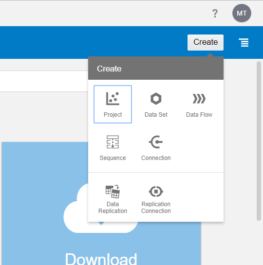{width="4.2756944444444445in"
    height="4.315277777777778in"}You may now head back to the home page
    and click **Create** in the right hand side and select **Project**

2.  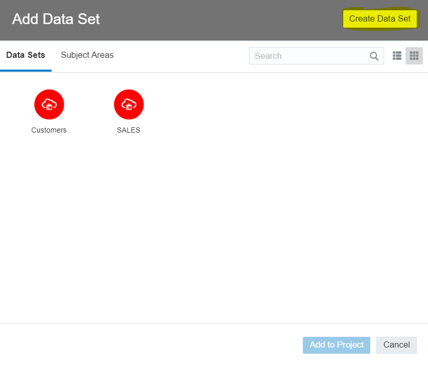{width="3.8652777777777776in"
    height="3.2979166666666666in"}You can select either from the
    existing data sets or create a new one, given that this is a fresh
    instalation, go ahead and click **Create Data Set**

3.  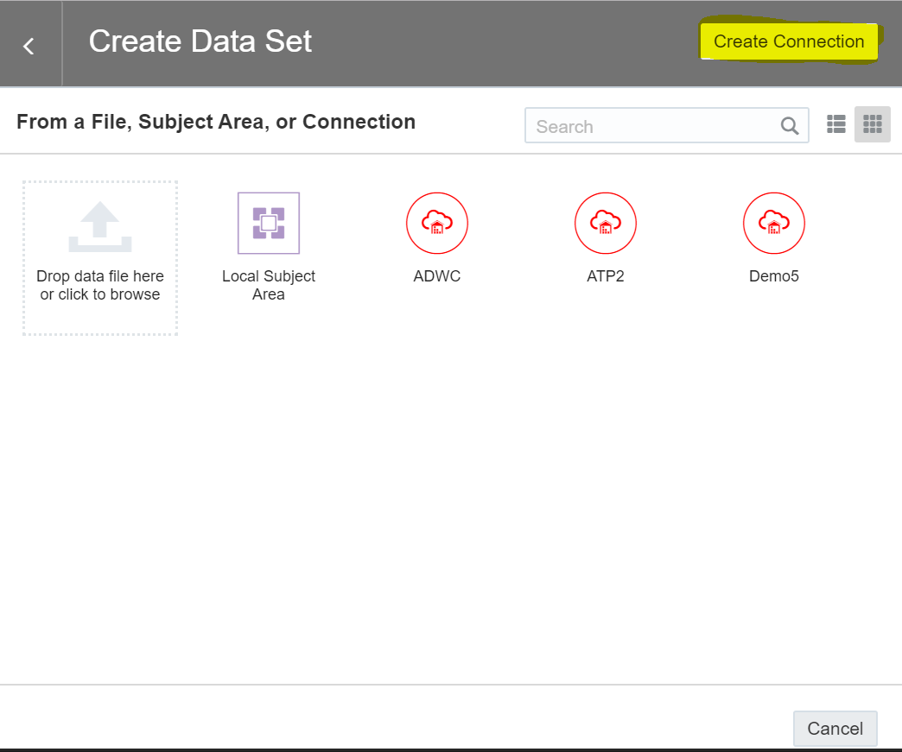{width="5.50625in" height="4.59375in"}In the
    **Create Data Set** dialog box there will be displayed all the
    current connections as well as the option to upload a file (.csv,
    .xlsx)

> 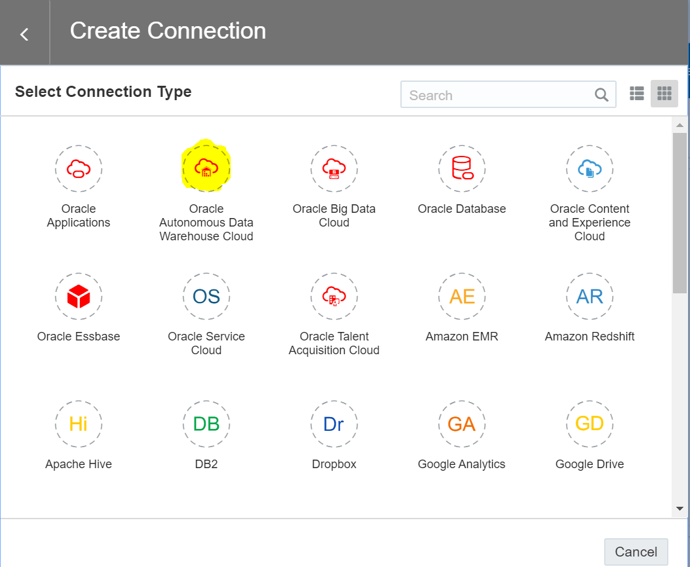{width="3.7472222222222222in"
> height="3.0819444444444444in"}Proceed to **Create Connection** in
> order to connect to a database.
>
> These is the list of possible connections in Oracle Analytics Cloud,
> for this workshop we are going to connect to **Oracle A**utonomous
> **D**ata **W**arehouse **C**loud (short -- ADWC or ADW).

4.  Fields for creating a connection to **ADWC**:

    -   **Connection Name:** This name will be used to display the
        connection for easier access on the screens that we have
        previously seen

    -   **Description (Optional)**: for internal purposes

    -   **Host:** host name from the wallet you have downloaded -- open
        **tnsnames**

    -   **Port:** default for **ADWC** is 1522, also available in the
        **tnsnames** file

    -   **Client Credentials:** browse for the .sso file provided in the
        wallet

    -   **Username:** the username you have provided when creating the
        **ADWC** instance

    -   **Password:** the password you have set

    -   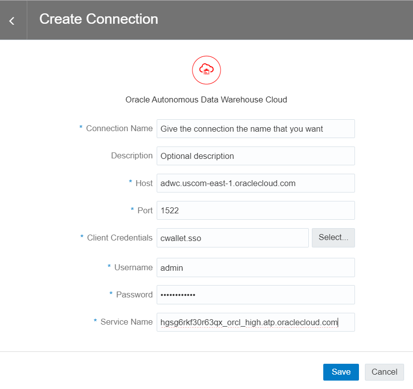{width="5.002777777777778in"
        height="4.720833333333333in"}**Service Name:** same procedure as
        for the **host** -- open **tnsnames**

This should be the end result. Click **Save** and proceed to the next
step.

5.  After completing the previous step, all the schemas in the database
    will be shown, for the purpose of this exercise we are going to use
    **SH** which is a sample schema provided with the creation of a new
    database.

    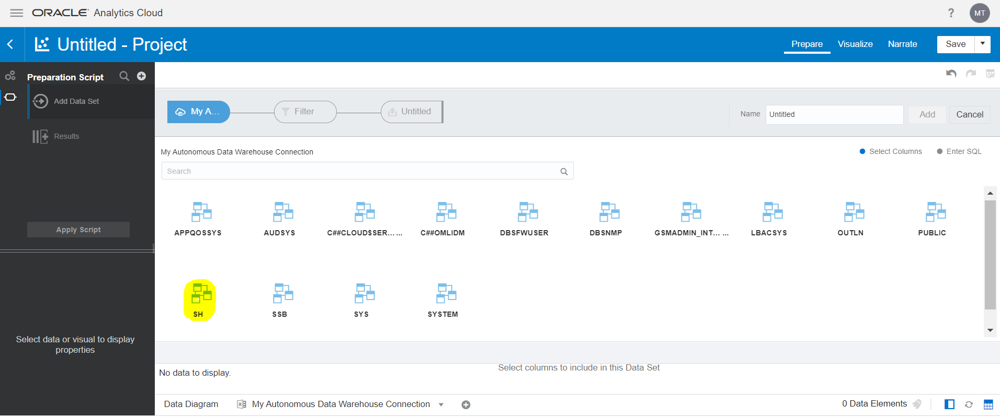{width="7.2444444444444445in"
    height="3.0347222222222223in"}Select **SH** to proceed.

6.  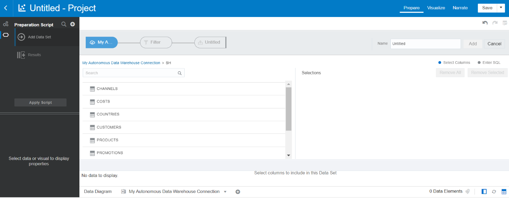{width="6.268055555555556in"
    height="2.4402777777777778in"}After selecting the schema, the
    following **Tables** will be retrieved, we are going to use the
    **Customers** table

7.  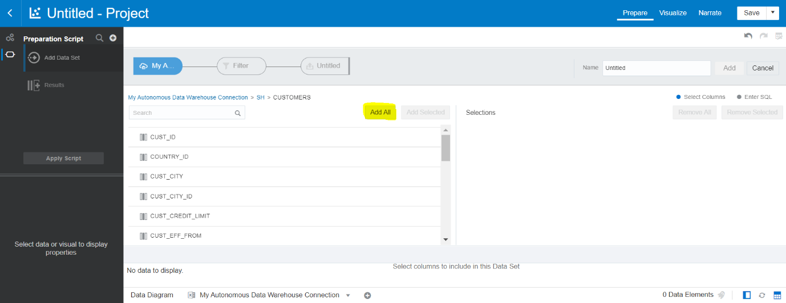{width="6.268055555555556in"
    height="2.4243055555555557in"}Now that you have selected the table,
    select all the columns by clicking **Add All**, afterwards you can
    name your dataset and finally click **Add** to finish the importing
    process.

8.  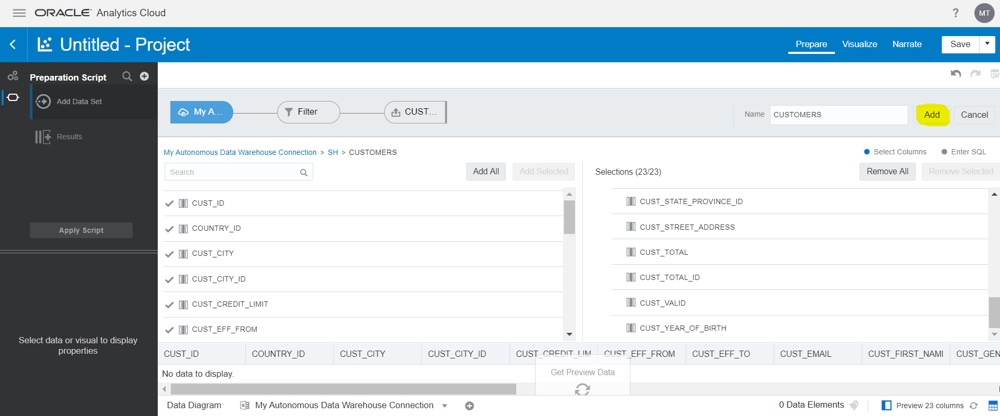{width="6.268055555555556in"
    height="2.4375in"}After you click **Add** the data will be available
    for preparation, by default columns that contain numeric values will
    be imported as measures (**\#**), to change that click on the symbol
    and select **Attribute**. Repeat this for all the columns that
    contain **ID** in their header.

> 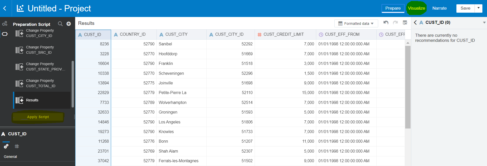{width="6.268055555555556in"
> height="2.1486111111111112in"}Once this is done, click **Apply
> Script** to save changes and proceed to the **Visualize** tab.
>
> 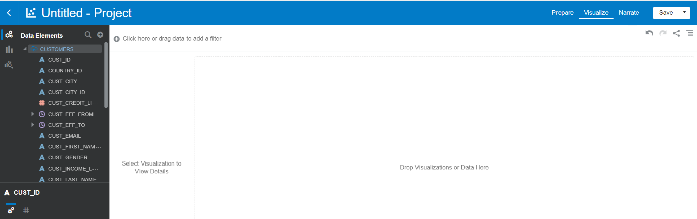{width="6.268055555555556in"
> height="1.9708333333333334in"}You will be taken to a blank canvas and
> on the left hand side you will see the dataset that you have created.

9.  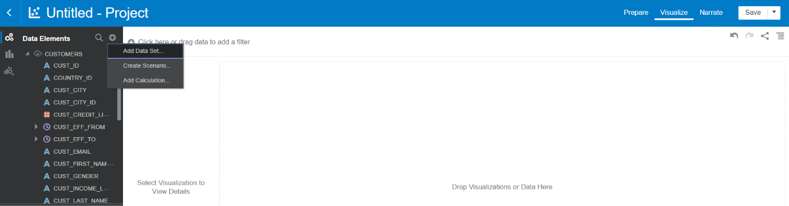{width="6.268055555555556in"
    height="1.64375in"}For the purpose of this exercise, we need an
    additional table, which can be added by clicking on the **+** sign
    next to the magnifier.

> An **Add Data Set** dialog box will pop up, the same one as we have
> seen in step 2. only this time we already have the connection created
>
> 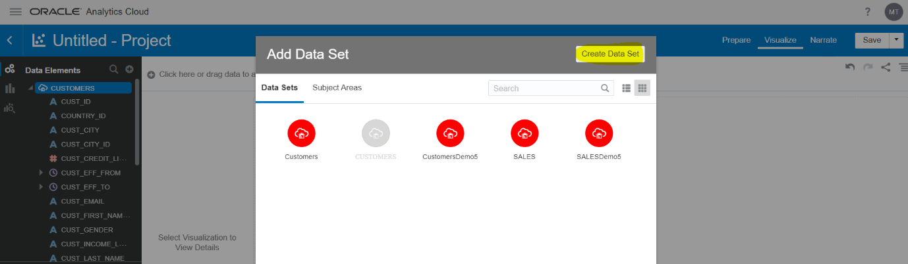{width="6.268055555555556in"
> height="1.8305555555555555in"}
>
> 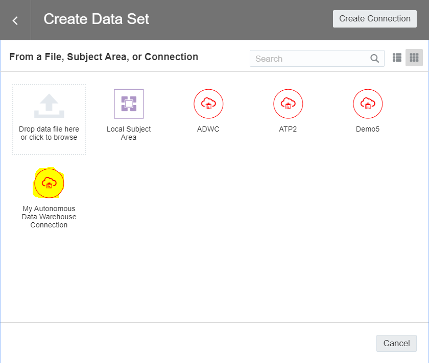{width="4.791666666666667in"
> height="4.061111111111111in"}Select the connection you have created:
>
> 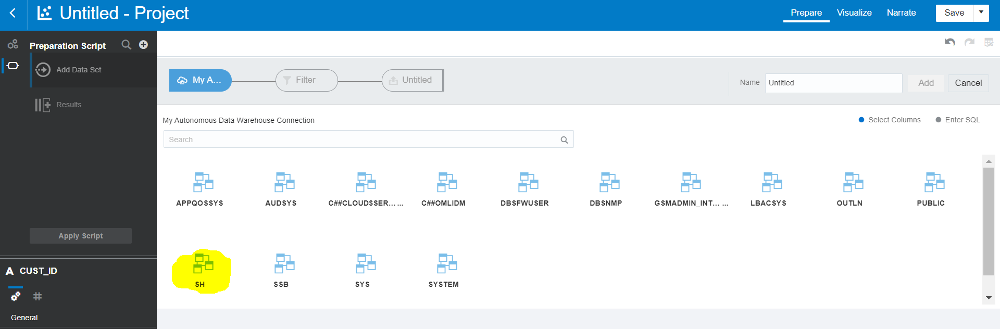{width="6.268055555555556in"
> height="2.0631944444444446in"}Choose the same schema -- **SH** -- and
> this time pick the table **SALES**, click **Add All**, name your
> dataset and finish by clicking **Add**
>
> 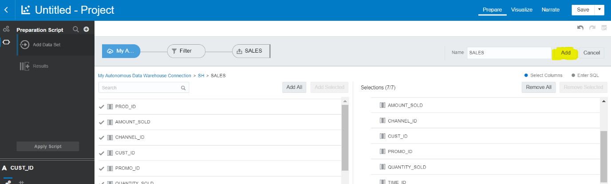{width="6.268055555555556in"
> height="1.8888888888888888in"}
>
> 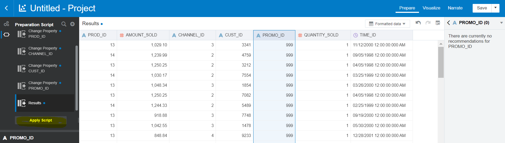{width="6.268055555555556in"
> height="1.7826388888888889in"}Make sure you change all the columns
> that contain **ID** to Attributes by clicking the **\#** sign, **Apply
> Script** and proceed to the next step.

10. In order to correlate data, we will **Join** columns that can be
    found in the same tables to create relationships between the
    datasets.

    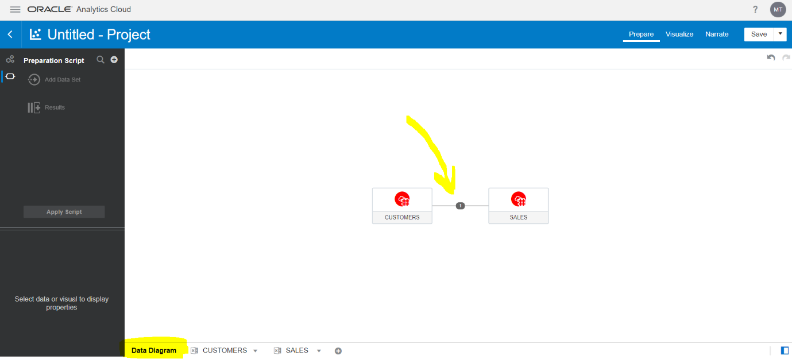{width="6.268055555555556in"
    height="2.838888888888889in"}This can be done by clicking **Data
    Diagram** on the bottom of the Canvas while you are in the
    **Prepare** section.

> 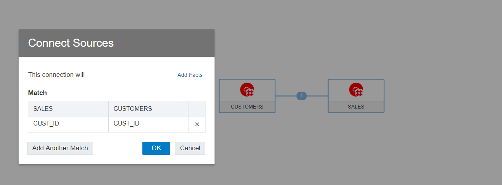{width="5.447222222222222in"
> height="2.015972222222222in"}Given the fact that we have uploaded the
> tables from the same schema and there are two columns with identical
> names **CUST\_ID**, the service has created the join automatically and
> now we can correlate data from two different sets. If the join does
> not exist, create one by clicking **Add Match**, select the matching
> columns and click **OK**.

11. Now that you have joined the datasets, click on **Visualize** and
    focus on the left hand side.

> Expand the datasets, hold **CTRL** to select both **CUST\_CITY** from
> **CUSTOMERS** and **AMOUNT\_SOLD** from **SALES**, right click and
> select **Create Best Visualization**.
>
> 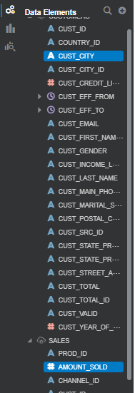{width="6.255752405949257in"
> height="6.27238845144357in"}
>
> 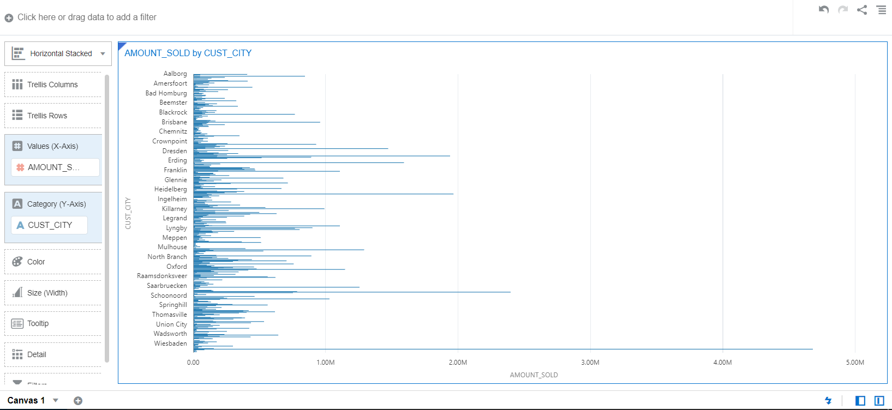{width="6.268055555555556in"
> height="2.8826388888888888in"}The result should look like this,
> although, while the result is readable, due to the high number of
> values in **CUST\_CITY**, some of the labels are not displayed.

12. 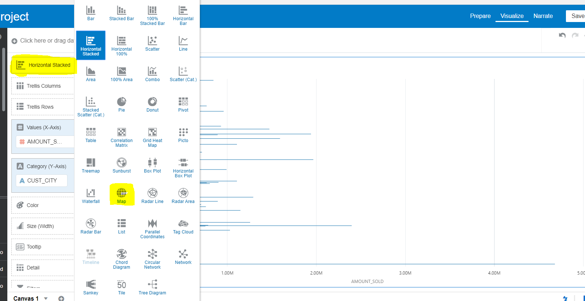{width="6.268055555555556in"
    height="3.2222222222222223in"}Change the visualization type to
    **Map** by clicking on the actual type -- **Horizontal Stacked**.

> 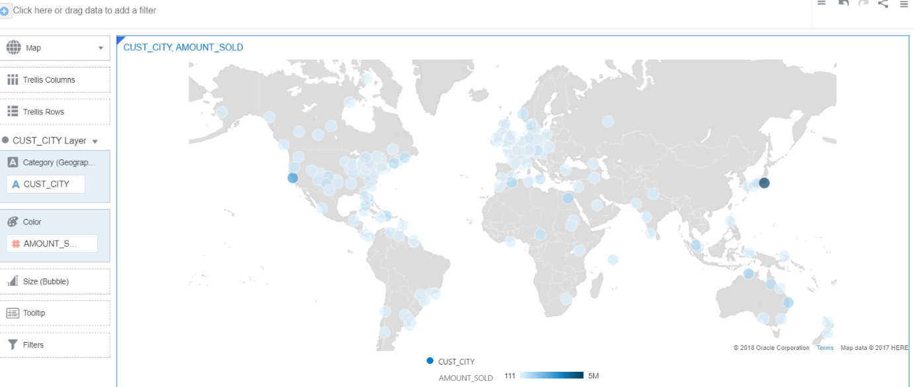{width="6.268055555555556in"
> height="2.65625in"}
>
> Now the values are displayed in an interactive map that you can zoom
> in on, drag around and check different values.
>
> 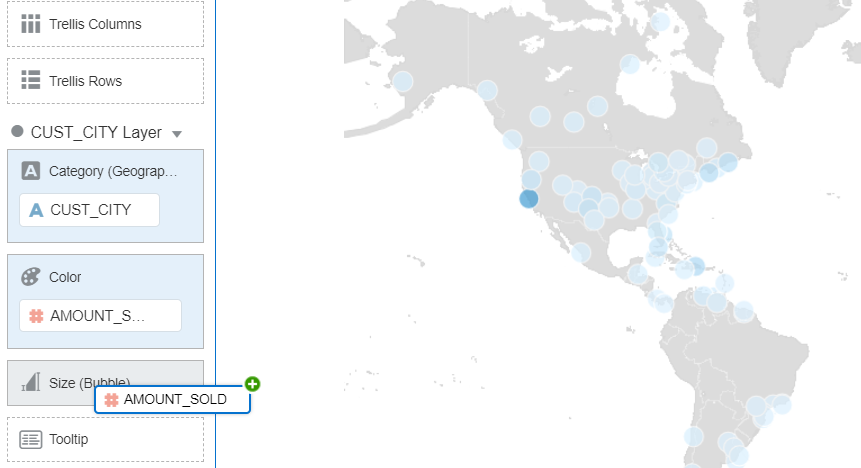{width="6.260416666666667in"
> height="3.40625in"}The colour of the bubble is based on the value of
> **AMOUNT\_SOLD**, for a better result, click and drag **AMOUNT\_SOLD**
> to **Size**.
>
> The end result is displayed below.
>
> 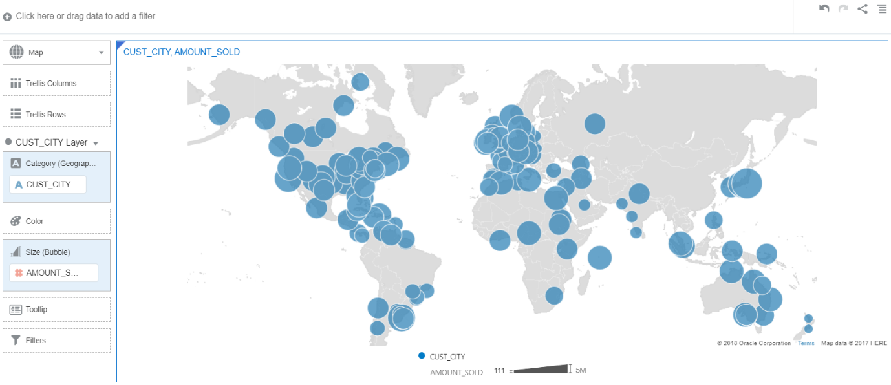{width="6.268055555555556in"
> height="2.720138888888889in"}

13. 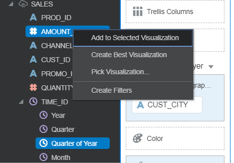{width="4.864583333333333in"
    height="3.3854166666666665in"}Create another visualization using
    **Create Best Visualization** by expanding **TIME\_ID** in **SALES**
    and selecting **AMOUNT\_SOLD** and **Quarter of Year**.

> 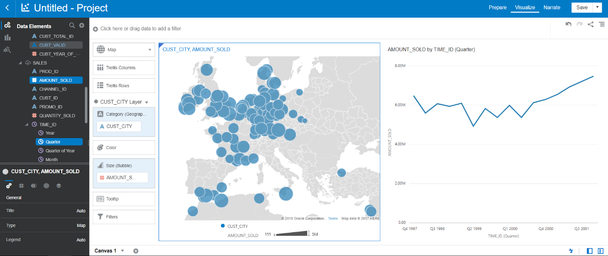{width="6.268055555555556in"
> height="2.6444444444444444in"}This visualization will automatically be
> positioned on the Canvas next to the previously created Map.
>
> Given the fact that **Quarter of Year** is a time dimension, we can
> add **Trend Lines**. To do that we hover on the top right corner of
> the visualization -- not the canvas, click the menu and **Add Trend
> Line**
>
> 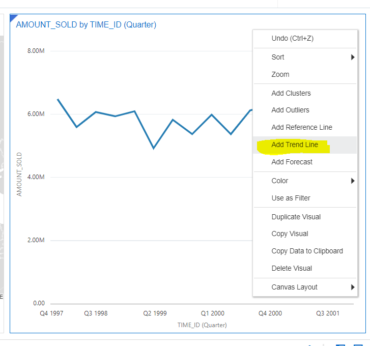{width="3.723611111111111in"
> height="3.4472222222222224in"}
>
> 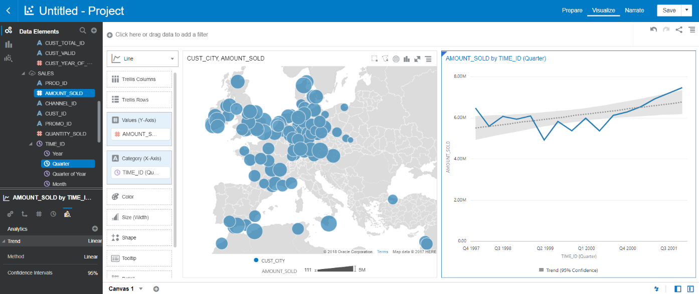{width="6.326388888888889in"
> height="2.678472222222222in"}This will generate a line on the
> visualization that summarizes the performance for the four years of
> data in our dataset.

14. 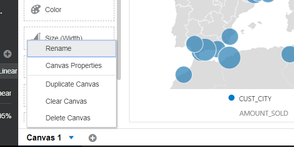{width="6.052083333333333in"
    height="3.0416666666666665in"}Rename the Canvas by clicking the
    drop-down property menu in the bottom left corner and select
    **Rename**.

> Give it a name and proceed to the next step.

15. 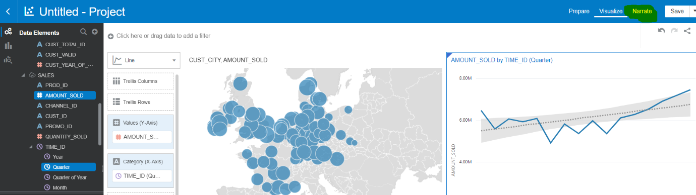{width="6.268055555555556in"
    height="1.7631944444444445in"}Clicking on **Narrate** you can add
    Canvases to present them in your meetings.

> Drag your canvas on the blank page, add a text box in which you can
> explain the depicted information and click
> Present.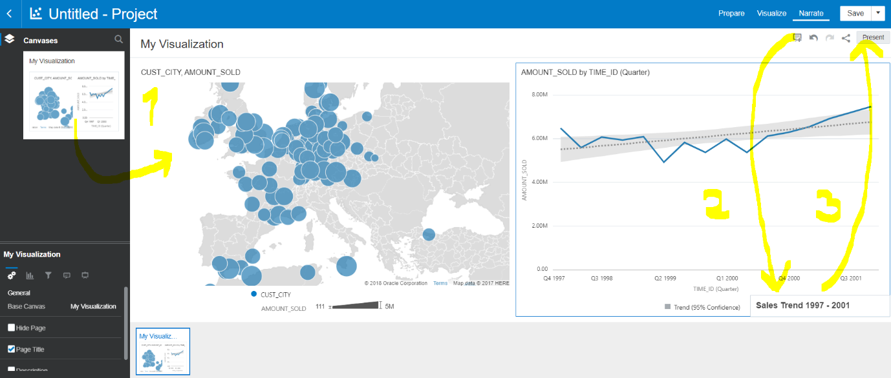{width="6.268055555555556in"
> height="2.6631944444444446in"}

#################### Section 7. Conclusion

Oracle Cloud Platform's built-in autonomous capabilities transform the
way cloud services are delivered and consumed. Benefits for
organizations include:

**Lower Cost**

-   Reduce administration costs by up to 80 percent with complete
    > automation of operations and tuning

-   Reduce runtime costs by up to 70 percent by paying only for
    > resources needed at any given time

-   Deploy new apps in minutes versus months, save tens of thousands of
    > dollars in resource costs

**Reduce Risk**

-   Mitigate breach impact by avoiding reputational damage, associated
    > breach costs, and revenue losses

-   Reduce human error; under 2.5 minutes of downtime per month.

-   Run highest throughput, mission-critical workloads on proven Oracle
    > and open source technologies

**Accelerate Innovation**

-   Develop new apps within hours with self-generating code, plus
    > intelligent and secure CI/CD pipelines

-   Deploy new business processes within minutes versus days with
    > voice-enabled, self-defining integrations

-   Provision a data warehouse in seconds and accelerate time to
    > innovation

**Predictive Insights**

-   Proactively discover new insights with ML-based continuous data
    > analysis

-   Analyze data using AI with predictive data visualization, narration,
    > and intelligent data discovery

-   Get proactive insights with comprehensive, in-database analytics for
    > SQL, ML, Graph, R, and Times series
